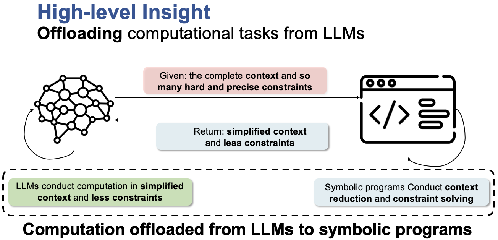
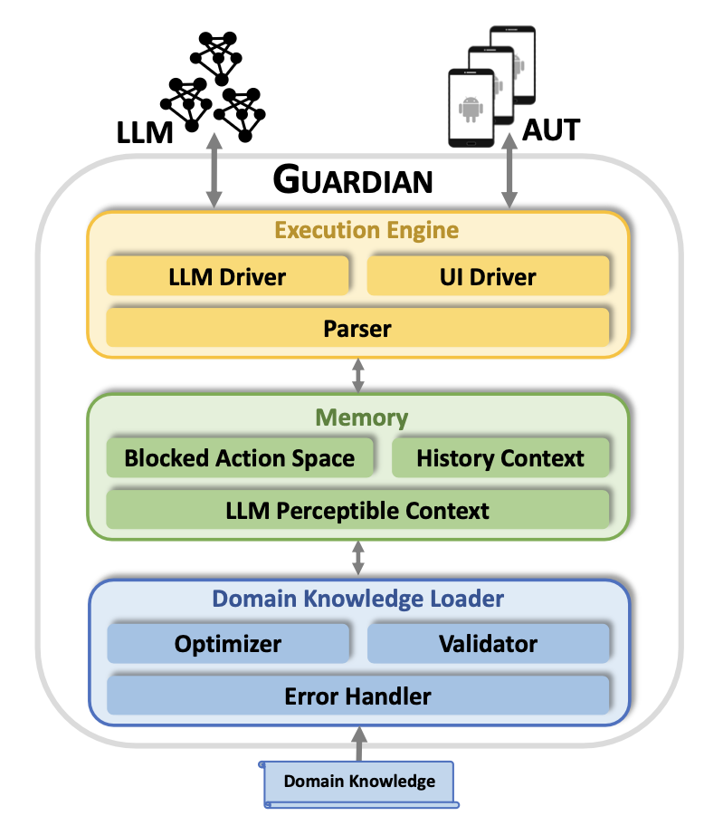

# Guardian: A Runtime Framework for LLM-Based UI Exploration

Guardian is a runtime framework for supporting LLM-based UI exploration. 
Guardian is designed to improve any given LLM agent with our novel concept of computation offloading. 

<!-- <p align="center"> Computation Offloading from LLMs to Symoblic Programs </p> -->

With computation offloading, Guardian allows the LLM agent to offload specific computational tasks such as to symbolic programs which can be used to improve the agent's performance. 


Guardian is designed to be easily integrated into any LLM agent, and can be used to improve the performance of any LLM agent. 


## NOTE
We are still testing the refactored version of Guardian, please try soon after our internal testing is done.

## Architecture of Guardian
The implementaion of Guardian strictly follows the overview presneted in our paper .


### Execution Engine


### Memory

### Domain Knowledge Loader

### Infrastructure 
We reuse part of our code originally used for developing [Badge](https://dl.acm.org/doi/abs/10.1109/ICSE48619.2023.00083), a tool for automated UI testing.


## Getting Started

These instructions will get you a copy of the project up and running on your local machine for development and testing purposes. See deployment for notes on how to deploy the project on a live system.

### Prerequisites

First create a virtual environment and install the [depedencies](requirements.txt)

```python
conda create -n guardian python=3.8.12 
pip install -r requirements.txt
```
Note that the dependencies of Guardian only requires the following packages:
- `uiautomator2==2.16.25` for the interactions with the App Under Test (AUT).
- `openai==0.27.2` and `tenacity==8.2.3` for robust ChatGPT API invocation.

We have tested Guardian with python 3.8.12.

### Setup Android Devices and App Under Test (AUT)

Please refer to [FestiVal Benchmark](https://github.com/PKU-ASE-RISE/FestiVal) proposed along with Guardian for Android device and AUT setup.


### Run Guardian for mobile UI navigation

```python
python run.py \
    --app_name Quizlet \
    --apk_name com.quizlet.quizletandroid \
    --testing_objective "turn on night mode" \
    --max_test_steps 30
```


## Cite our work
If your find this work useful, please consider cite the following paper:

```
@inproceedings{ran2024guardian,
author = {Ran, Dezhi and Wang, Hao and Song, Zihe and Wu, Mengzhou and Cao, Yuan and Zhang, Ying and Yang, Wei and Xie, Tao},
title = {Guardian: A Runtime Framework for LLM-Based UI Exploration},
year = {2024},
isbn = {9798400706127},
publisher = {Association for Computing Machinery},
address = {New York, NY, USA},
url = {https://doi.org/10.1145/3650212.3680334},
doi = {10.1145/3650212.3680334},
booktitle = {Proceedings of the 33rd ACM SIGSOFT International Symposium on Software Testing and Analysis},
pages = {958–970},
numpages = {13},
series = {ISSTA 2024}
}
```


